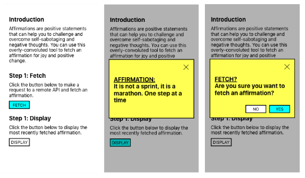

# Irene's React Native coding challenge

Hi Rafal, here's my code solution to the challenge.

## Brief

I ran in a couple issues with running a mobile emulator on the current laptop I'm using (I think due to its age). However, I did manage to run my code in an Expo project and just copy-paste into this project. Expo allowed me to run an emulator in my browser and test on a variety of devices. 

I pushed directly to `master` because it's just me here. 

I used the fonts included in the original code, however, the weights didn't differentiate from "bold" to "medium" to "light"--not sure where I went wrong--so I just used the `fontWeight` property to modify to match the designs. 

Here are some screenshots of my final product on iPhone SE:

